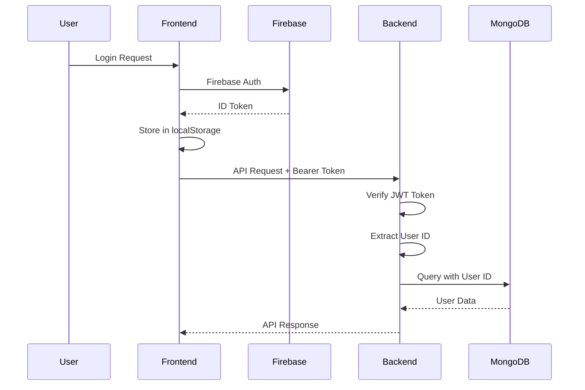
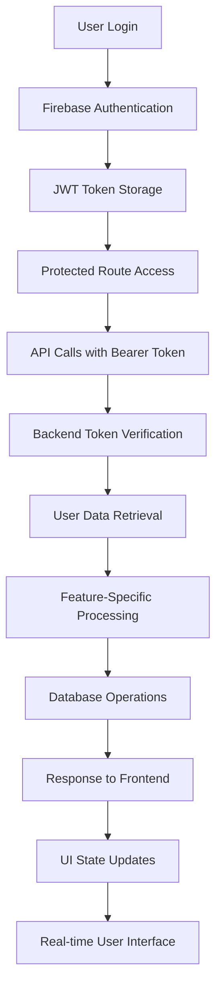
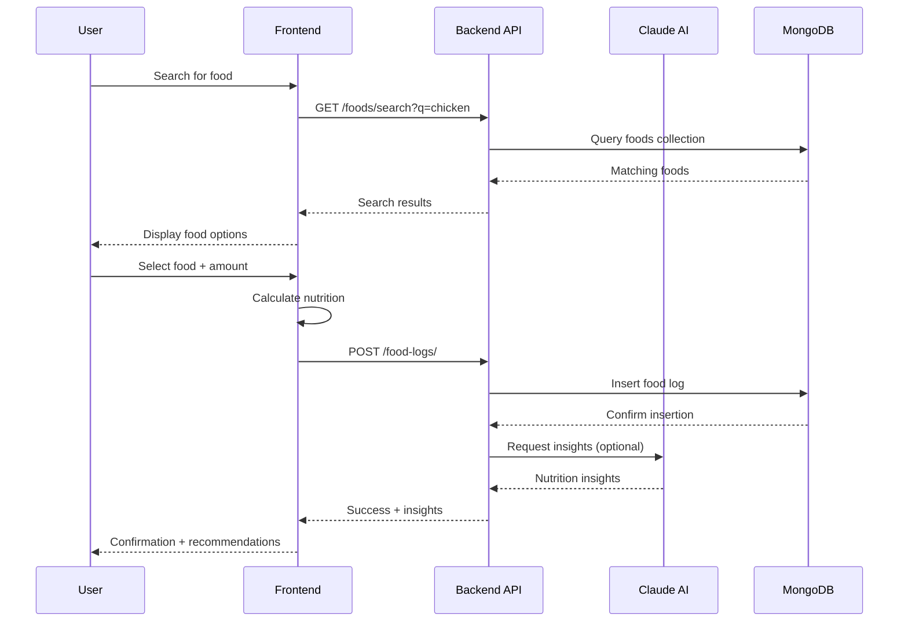
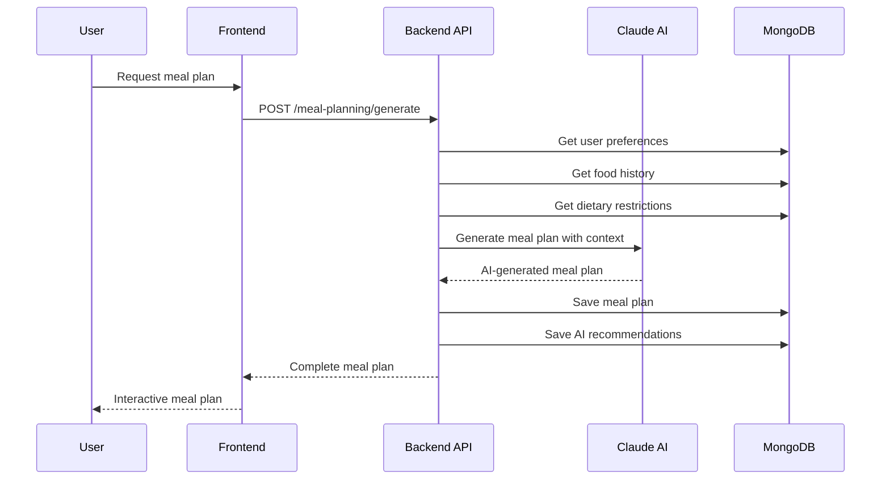

# 🏗️ Nutrivize V2 - System Architecture Documentation

## 📋 **Table of Contents**
- [System Overview](#system-overview)
- [Technology Stack](#technology-stack)
- [Application Architecture](#application-architecture)
- [Database Design](#database-design)
- [Authentication & Security](#authentication--security)
- [API Architecture](#api-architecture)
- [Frontend Architecture](#frontend-architecture)
- [Data Flow](#data-flow)
- [Deployment Architecture](#deployment-architecture)
- [Performance & Scalability](#performance--scalability)

---

## 🎯 **System Overview**

Nutrivize V2 is a comprehensive **nutrition tracking and AI-powered meal planning application** built with modern web technologies. The system enables users to:

- **Track nutrition** with intelligent food logging
- **Plan meals** using AI-powered recommendations
- **Analyze health data** with advanced analytics
- **Manage dietary preferences** and restrictions
- **Get personalized coaching** from AI assistants

### **Core Value Propositions**
- 🤖 **AI-Powered Intelligence**: Claude-based meal planning and health insights
- 📱 **Mobile-First Design**: Progressive Web App (PWA) capabilities
- 🔒 **Enterprise Security**: Firebase authentication with JWT tokens
- 📊 **Advanced Analytics**: Real-time nutrition tracking and goal monitoring
- 🌐 **Scalable Architecture**: Microservices-ready FastAPI backend

---

## 🛠️ **Technology Stack**

### **Backend Stack**
```yaml
Framework: FastAPI (Python 3.11+)
Database: MongoDB Atlas (Cloud NoSQL)
Authentication: Firebase Authentication
AI Engine: Anthropic Claude API
Image Processing: Google Cloud Vision API
Web Server: Uvicorn ASGI
Deployment: Render.com
```

### **Frontend Stack**
```yaml
Framework: React 18 (TypeScript)
UI Library: Chakra UI
State Management: React Context + Hooks
Routing: React Router v6
Build Tool: Vite
PWA: Workbox (Service Worker)
Deployment: Render.com (Static Site)
```

### **Development Tools**
```yaml
Package Management: npm (frontend), pip (backend)
Code Quality: TypeScript, ESLint, Prettier
API Documentation: FastAPI Swagger/OpenAPI
Version Control: Git
Deployment: Shell scripts, Docker
```

---

## 🏛️ **Application Architecture**

### **High-Level Architecture**
```
┌─────────────────┐    ┌─────────────────┐    ┌─────────────────┐
│                 │    │                 │    │                 │
│   Frontend      │    │   Backend       │    │   External      │
│   (React/TS)    │◄──►│   (FastAPI)     │◄──►│   Services      │
│                 │    │                 │    │                 │
└─────────────────┘    └─────────────────┘    └─────────────────┘
        │                        │                        │
        ▼                        ▼                        ▼
┌─────────────────┐    ┌─────────────────┐    ┌─────────────────┐
│ • Chakra UI     │    │ • Route Modules │    │ • MongoDB Atlas │
│ • React Router  │    │ • Service Layer │    │ • Firebase Auth │
│ • Context API   │    │ • Data Models   │    │ • Claude API    │
│ • PWA Features  │    │ • Middleware    │    │ • Google Vision │
└─────────────────┘    └─────────────────┘    └─────────────────┘
```

### **Backend Architecture Pattern**
The backend follows a **clean architecture pattern** with clear separation of concerns:

```
backend/app/
├── main.py                 # FastAPI application entry point
├── core/                   # Core system components
│   ├── config.py          # Database and environment configuration
│   ├── firebase.py        # Firebase authentication manager
│   └── middleware.py      # CORS, logging, and security middleware
├── routes/                 # API endpoint definitions (17 modules)
│   ├── auth.py            # Authentication endpoints
│   ├── foods.py           # Food database management
│   ├── food_logs.py       # Nutrition logging
│   ├── ai.py              # AI chat and recommendations
│   ├── meal_planning.py   # Meal planning system
│   ├── analytics.py       # Usage and nutrition analytics
│   └── ...               # 11 additional specialized modules
├── services/              # Business logic layer
│   ├── ai_service.py      # Claude API integration
│   ├── food_service.py    # Food data management
│   ├── user_service.py    # User profile management
│   └── ...               # Additional service modules
├── models/                # Pydantic data models
│   ├── user.py           # User-related schemas
│   ├── food.py           # Food and nutrition schemas
│   ├── meal_plan.py      # Meal planning schemas
│   └── ...               # Additional model definitions
└── utils/                 # Utility functions and helpers
    ├── database.py        # MongoDB connection utilities
    ├── auth_utils.py      # JWT token management
    └── validation.py      # Data validation helpers
```

### **Frontend Architecture Pattern**
The frontend uses a **feature-based component architecture** with shared utilities:

```
frontend/src/
├── App.tsx                 # Root application component
├── components/             # Reusable UI components (organized by feature)
│   ├── auth/              # Authentication components
│   ├── food/              # Food-related components (12 components)
│   ├── nutrition/         # Nutrition analysis components
│   ├── dashboard/         # Dashboard and analytics components
│   ├── ui/                # Generic UI components (navigation, forms)
│   └── analytics/         # Advanced analytics components
├── pages/                 # Top-level page components (22 pages)
│   ├── AIDashboard.tsx    # Main dashboard (home page)
│   ├── FoodLog.tsx        # Food logging interface
│   ├── MealPlans.tsx      # Meal planning system
│   ├── Analytics.tsx      # Analytics dashboard
│   └── ...               # 18 additional pages
├── contexts/              # React Context providers
│   ├── AuthContext.tsx    # Firebase authentication state
│   ├── AppStateContext.tsx # Global application state
│   └── FoodIndexContext.tsx # Food database state management
├── hooks/                 # Custom React hooks
│   ├── useAuth.ts         # Authentication hook
│   ├── useApi.ts          # API interaction hook
│   └── ...               # Additional custom hooks
├── utils/                 # Utility functions
│   ├── api.ts             # Axios API client configuration
│   ├── auth.ts            # Firebase authentication utilities
│   └── validation.ts      # Form validation utilities
└── types/                 # TypeScript type definitions
    ├── index.ts           # Common type exports
    ├── food.ts            # Food-related types
    └── user.ts            # User-related types
```

---

## 🗄️ **Database Design**

### **MongoDB Collections Schema**

#### **Users Collection**
```javascript
{
  _id: ObjectId,
  uid: String,              // Firebase UID (unique)
  email: String,
  name: String,
  created_at: ISODate,
  updated_at: ISODate,
  profile: {
    age: Number,
    gender: String,
    height_cm: Number,
    weight_kg: Number,
    activity_level: String,
    dietary_preferences: [String],
    allergens: [String],
    health_goals: [String]
  },
  preferences: {
    units: String,           // "metric" | "imperial"
    timezone: String,
    notifications: Boolean,
    privacy_level: String
  }
}
```

#### **Foods Collection**
```javascript
{
  _id: ObjectId,
  name: String,             // Food name
  brand: String,            // Optional brand name
  category: String,         // Food category
  serving_size: Number,     // Default serving size
  serving_unit: String,     // "cup", "gram", "piece", etc.
  nutrition: {
    calories: Number,
    protein: Number,        // grams
    carbs: Number,          // grams
    fat: Number,            // grams
    fiber: Number,          // grams
    sugar: Number,          // grams
    sodium: Number,         // milligrams
    cholesterol: Number,    // milligrams
    saturated_fat: Number,  // grams
    trans_fat: Number       // grams
  },
  dietary_attributes: {
    vegetarian: Boolean,
    vegan: Boolean,
    gluten_free: Boolean,
    dairy_free: Boolean,
    nut_free: Boolean,
    kosher: Boolean,
    halal: Boolean
  },
  barcode: String,          // Optional UPC/EAN barcode
  source: String,           // "USDA", "user", "restaurant", etc.
  created_by: String,       // User ID if user-created
  created_at: ISODate,
  updated_at: ISODate,
  search_keywords: [String], // For improved search
  popularity_score: Number   // Usage-based ranking
}
```

#### **Food Logs Collection**
```javascript
{
  _id: ObjectId,
  user_id: String,          // Firebase UID
  date: ISODate,            // Date of consumption
  meal_type: String,        // "breakfast", "lunch", "dinner", "snack"
  food_id: ObjectId,        // Reference to Foods collection
  food_name: String,        // Cached food name
  amount: Number,           // Consumed amount
  unit: String,             // Unit of measurement
  nutrition: {              // Calculated nutrition for this entry
    calories: Number,
    protein: Number,
    carbs: Number,
    fat: Number,
    fiber: Number,
    sugar: Number,
    sodium: Number
  },
  notes: String,            // Optional user notes
  logged_at: ISODate,       // When the entry was logged
  created_at: ISODate,
  updated_at: ISODate
}
```

#### **Meal Plans Collection**
```javascript
{
  _id: ObjectId,
  user_id: String,          // Firebase UID
  plan_id: String,          // Unique plan identifier
  name: String,             // Plan name
  description: String,      // Plan description
  days: Number,             // Number of days (1-30)
  calories_per_day: Number, // Target calories
  protein_target: Number,   // Daily protein target (grams)
  carbs_target: Number,     // Daily carbs target (grams)
  fat_target: Number,       // Daily fat target (grams)
  dietary_preferences: [String], // Applied dietary filters
  days: [{                  // Daily meal structure
    day_number: Number,
    date: String,           // YYYY-MM-DD format
    meals: [{
      meal_type: String,
      food_name: String,
      food_id: ObjectId,
      amount: Number,
      unit: String,
      nutrition: Object,
      notes: String,
      is_logged: Boolean    // Whether this meal was logged to food diary
    }],
    daily_nutrition: {      // Calculated daily totals
      calories: Number,
      protein: Number,
      carbs: Number,
      fat: Number
    }
  }],
  is_active: Boolean,       // Whether plan is currently active
  created_at: ISODate,
  updated_at: ISODate,
  generated_by: String      // "ai" | "manual" | "template"
}
```

#### **User Favorites Collection**
```javascript
{
  _id: ObjectId,
  user_id: String,          // Firebase UID
  food_id: ObjectId,        // Reference to Foods collection
  food_name: String,        // Cached food name
  custom_name: String,      // User's custom name for this food
  category: String,         // "breakfast", "lunch", "dinner", "snack", "general"
  default_serving_size: Number, // User's preferred serving size
  default_serving_unit: String, // User's preferred unit
  tags: [String],           // User-defined tags
  notes: String,            // User notes
  usage_count: Number,      // How many times used
  last_used: ISODate,       // Last time this favorite was used
  nutrition: Object,        // Cached nutrition info
  dietary_attributes: Object, // Cached dietary attributes
  created_at: ISODate,
  updated_at: ISODate
}
```

#### **AI Chat History Collection**
```javascript
{
  _id: ObjectId,
  user_id: String,          // Firebase UID
  session_id: String,       // Chat session identifier
  messages: [{
    role: String,           // "user" | "assistant"
    content: String,        // Message content
    timestamp: ISODate,
    context: {              // Additional context for AI responses
      food_recommendations: [ObjectId],
      meal_suggestions: [Object],
      nutrition_data: Object
    }
  }],
  context_summary: {        // Session-level context
    user_goals: [String],
    dietary_preferences: [String],
    recent_foods: [ObjectId],
    current_nutrition: Object
  },
  created_at: ISODate,
  updated_at: ISODate
}
```

### **Database Indexing Strategy**
```javascript
// Performance-critical indexes
db.users.createIndex({ "uid": 1 }, { unique: true })
db.food_logs.createIndex({ "user_id": 1, "date": -1 })
db.food_logs.createIndex({ "user_id": 1, "meal_type": 1, "date": -1 })
db.foods.createIndex({ "name": "text", "search_keywords": "text" })
db.foods.createIndex({ "category": 1, "popularity_score": -1 })
db.meal_plans.createIndex({ "user_id": 1, "is_active": 1 })
db.user_favorites.createIndex({ "user_id": 1, "category": 1 })
db.user_favorites.createIndex({ "user_id": 1, "usage_count": -1 })
db.ai_chat_history.createIndex({ "user_id": 1, "created_at": -1 })
```

---

## 🔐 **Authentication & Security**

### **Authentication Flow**


### **Security Measures**

#### **Frontend Security**
- **JWT Token Management**: Automatic token refresh and secure storage
- **Route Protection**: All pages require authentication
- **Input Validation**: Client-side validation with TypeScript
- **XSS Prevention**: Chakra UI components with built-in sanitization
- **CORS Configuration**: Restricted to allowed origins

#### **Backend Security**
- **Firebase Token Verification**: Every request validates JWT tokens
- **User Data Isolation**: All queries filtered by authenticated user ID
- **Input Validation**: Pydantic models with strict typing
- **Rate Limiting**: API endpoint throttling (future enhancement)
- **Environment Variables**: Sensitive data stored securely

#### **Database Security**
- **Connection Security**: TLS encryption for MongoDB Atlas
- **Access Control**: Database-level authentication
- **Data Isolation**: User-specific data segregation
- **Backup Strategy**: Automated cloud backups

### **User Data Privacy**
```python
# Example of user data isolation in backend
@router.get("/food-logs/")
async def get_food_logs(
    current_user: User = Depends(get_current_user),
    db: Database = Depends(get_database)
):
    # Automatically filter by authenticated user
    logs = await db.food_logs.find({
        "user_id": current_user.uid  # Only user's own data
    }).to_list(100)
    return logs
```

---

## 🔗 **API Architecture**

### **RESTful API Design**
The backend exposes **17 specialized route modules** with over **80 endpoints**:

#### **Core API Modules**
1. **Authentication (`/auth/`)** - User login, registration, token management
2. **Foods (`/foods/`)** - Food database search, CRUD operations  
3. **Food Logs (`/food-logs/`)** - Nutrition logging and history
4. **AI Services (`/ai/`)** - Claude-powered chat and recommendations
5. **Meal Planning (`/meal-planning/`)** - AI and manual meal plan generation
6. **Analytics (`/analytics/`)** - Nutrition and usage analytics
7. **User Preferences (`/preferences/`)** - User settings and preferences
8. **Goals (`/goals/`)** - Health and nutrition goal tracking
9. **Favorites (`/favorites/`)** - User favorite foods management

#### **Specialized API Modules**
10. **Restaurant AI (`/restaurant-ai/`)** - Menu analysis and recommendations
11. **AI Dashboard (`/ai-dashboard/`)** - Dashboard-specific AI insights
12. **AI Health (`/ai-health/`)** - Health score calculations and coaching
13. **User Foods (`/user-foods/`)** - Custom user-created foods
14. **Dietary Preferences (`/dietary/`)** - Dietary restriction management
15. **Water Logs (`/water-logs/`)** - Hydration tracking
16. **Weight Logs (`/weight-logs/`)** - Weight tracking and trends
17. **Nutrition Labels (`/nutrition-labels/`)** - OCR nutrition label processing

### **API Response Patterns**
```typescript
// Standard API Response Structure
interface APIResponse<T> {
  data: T
  message?: string
  status: 'success' | 'error'
  timestamp: string
  meta?: {
    total?: number
    page?: number
    limit?: number
  }
}

// Error Response Structure  
interface APIError {
  detail: string | ValidationError[]
  status_code: number
  timestamp: string
  path: string
}
```

### **Request/Response Examples**

#### **Food Search Endpoint**
```http
GET /foods/search?q=chicken&limit=10
Authorization: Bearer <jwt_token>

Response:
{
  "data": [
    {
      "id": "507f1f77bcf86cd799439011",
      "name": "Chicken Breast, Grilled",
      "category": "protein",
      "serving_size": 100,
      "serving_unit": "gram",
      "nutrition": {
        "calories": 165,
        "protein": 31.0,
        "carbs": 0.0,
        "fat": 3.6,
        "fiber": 0.0,
        "sodium": 74
      },
      "dietary_attributes": {
        "gluten_free": true,
        "dairy_free": true,
        "vegetarian": false
      }
    }
  ],
  "meta": {
    "total": 42,
    "limit": 10
  }
}
```

#### **Food Logging Endpoint**
```http
POST /food-logs/
Authorization: Bearer <jwt_token>
Content-Type: application/json

{
  "date": "2025-01-20",
  "meal_type": "lunch",
  "food_id": "507f1f77bcf86cd799439011",
  "amount": 150,
  "unit": "gram",
  "notes": "Post-workout meal"
}

Response:
{
  "data": {
    "id": "507f1f77bcf86cd799439012",
    "nutrition": {
      "calories": 247.5,
      "protein": 46.5,
      "carbs": 0.0,
      "fat": 5.4
    },
    "logged_at": "2025-01-20T18:30:00Z"
  },
  "message": "Food logged successfully"
}
```

---

## 🎨 **Frontend Architecture**

### **Component Organization**
The frontend follows a **feature-based architecture** with shared components:

#### **Component Categories**
- **`auth/`** - Authentication forms and flows
- **`food/`** - Food search, logging, and management (12 components)
- **`nutrition/`** - Nutrition analysis and coaching
- **`dashboard/`** - AI dashboard and analytics widgets
- **`ui/`** - Reusable UI components (navigation, modals, forms)
- **`analytics/`** - Advanced analytics and reporting

#### **Key Component Examples**

**BatchFoodLogging Component** (Featured in attachment):
```typescript
// Comprehensive batch food logging with:
// - Multi-food selection and management
// - Batch operations (log all, apply changes)
// - Real-time nutrition calculation
// - Advanced search and filtering
// - Day/meal type selection
// - Notes and customization
interface BatchFoodEntry {
  id: string
  food_item: FoodItem
  serving_size: number
  meal_type: string
  date: string
  notes?: string
  logged: boolean
}
```

### **State Management Architecture**

#### **Context Providers**
```typescript
// AuthContext - Firebase authentication state
interface AuthContextType {
  user: User | null
  loading: boolean
  login: (email: string, password: string) => Promise<void>
  register: (email: string, password: string, name: string) => Promise<void>
  logout: () => Promise<void>
}

// AppStateContext - Global application state
interface AppStateContextType {
  currentDate: string
  selectedMealType: string
  navigationHistory: string[]
  setCurrentDate: (date: string) => void
  setSelectedMealType: (type: string) => void
}

// FoodIndexContext - Food database management
interface FoodIndexContextType {
  foods: FoodItem[]
  loading: boolean
  searchFoods: (query: string) => Promise<FoodItem[]>
  addCustomFood: (food: FoodItem) => Promise<void>
  favoriteFood: (foodId: string) => Promise<void>
}
```

### **Routing Architecture**
```typescript
// React Router v6 with protected routes
<Routes>
  <Route path="/" element={<AIDashboard />} />           // Main dashboard
  <Route path="/food-log" element={<FoodLog />} />       // Food logging
  <Route path="/food-index" element={<FoodIndex />} />   // Food database
  <Route path="/meal-plans" element={<MealPlans />} />   // Meal planning
  <Route path="/analytics" element={<Analytics />} />    // Analytics
  <Route path="/ai-chat" element={<AIChat />} />         // AI assistant
  <Route path="/restaurant-ai" element={<RestaurantAI />} /> // Restaurant AI
  <Route path="/settings" element={<Settings />} />      // User settings
  // ... 14 additional protected routes
</Routes>
```

### **PWA Features**
```typescript
// Progressive Web App capabilities
{
  "name": "Nutrivize V2",
  "short_name": "Nutrivize",
  "display": "standalone",
  "orientation": "portrait",
  "theme_color": "#4CAF50",
  "background_color": "#ffffff",
  "start_url": "/",
  "scope": "/",
  "icons": [...], // Various sizes for different devices
  "screenshots": [...] // App store screenshots
}
```

---

## 📊 **Data Flow**

### **User Journey Data Flow**


### **Food Logging Flow**


### **AI-Powered Meal Planning Flow**


---

## 🚀 **Deployment Architecture**

### **Render.com Deployment**
```yaml
# Production deployment configuration
Backend:
  Service: Web Service
  Runtime: Python 3.11
  Build Command: pip install -r requirements.txt
  Start Command: uvicorn app.main:app --host 0.0.0.0 --port $PORT
  Environment: Production
  Auto-Deploy: Yes (from main branch)

Frontend:
  Service: Static Site
  Build Command: npm run build
  Publish Directory: dist
  Node Version: 18.x
  Environment: Production
  Auto-Deploy: Yes (from main branch)
```

### **Environment Configuration**
```bash
# Backend environment variables
ENVIRONMENT=production
MONGODB_URL=mongodb+srv://...
ANTHROPIC_API_KEY=sk-ant-...
FIREBASE_SERVICE_ACCOUNT_BASE64=eyJ0eXBlIjoi...
GOOGLE_CLOUD_VISION_CREDENTIALS_BASE64=eyJ0eXBlIjoi...
SECRET_KEY=nutrivize-production-secret-key-2025
FRONTEND_URL=https://nutrivize-frontend.onrender.com

# Frontend environment variables  
VITE_API_BASE_URL=https://nutrivize-backend.onrender.com
VITE_ENVIRONMENT=production
VITE_FIREBASE_API_KEY=AIzaSyC...
VITE_FIREBASE_AUTH_DOMAIN=food-tracker-6096d.firebaseapp.com
VITE_FIREBASE_PROJECT_ID=food-tracker-6096d
```

### **CORS Configuration**
```python
# Production CORS settings
origins = [
    "http://localhost:3000",    # Local development
    "http://localhost:5173",    # Vite dev server
    "https://nutrivize-frontend.onrender.com",  # Production frontend
    "https://nutrivize.onrender.com",           # Alternative domain
]
```

---

## ⚡ **Performance & Scalability**

### **Backend Performance**
- **Async Architecture**: FastAPI with async/await for non-blocking operations
- **Database Indexing**: Strategic indexes on high-query fields
- **Connection Pooling**: MongoDB connection reuse
- **Response Caching**: In-memory caching for frequently accessed data
- **API Rate Limiting**: Prevent abuse and ensure fair usage

### **Frontend Performance**
- **Code Splitting**: Lazy loading for route components
- **Bundle Optimization**: Vite with tree shaking and minification
- **State Management**: Efficient React Context and hooks
- **Image Optimization**: WebP format with fallbacks
- **Caching Strategy**: Service worker for offline functionality

### **Scalability Considerations**
- **Horizontal Scaling**: Stateless backend design for multiple instances
- **Database Sharding**: MongoDB sharding strategy for user data
- **CDN Integration**: Static asset delivery optimization
- **Microservices Ready**: Modular backend architecture for service separation
- **API Versioning**: Backward-compatible API evolution

### **Monitoring & Analytics**
- **Application Metrics**: Request rates, response times, error rates
- **User Analytics**: Feature usage, performance metrics
- **Health Checks**: Automated system health monitoring
- **Error Tracking**: Comprehensive error logging and alerting
- **Performance Monitoring**: Real-time performance insights

---

## 🔧 **Development Workflow**

### **Local Development Setup**
```bash
# Start development environment
./scripts/development/start-nutrivize.sh

# Services will be available at:
# Frontend: http://localhost:5173
# Backend:  http://localhost:8000
# API Docs: http://localhost:8000/docs
```

### **Code Organization Standards**
- **TypeScript**: Strict typing for frontend code
- **Python Type Hints**: Backend code with comprehensive typing
- **Component Structure**: Feature-based organization
- **API Design**: RESTful endpoints with clear naming
- **Error Handling**: Comprehensive error management

### **Testing Strategy**
- **Unit Testing**: Component and service testing
- **Integration Testing**: API endpoint testing
- **E2E Testing**: User workflow testing
- **Performance Testing**: Load and stress testing
- **Security Testing**: Authentication and authorization testing

---

This architecture documentation provides a comprehensive overview of the Nutrivize V2 system design, from high-level architecture down to implementation details. The system is built for scalability, maintainability, and user experience, with modern technologies and best practices throughout.
