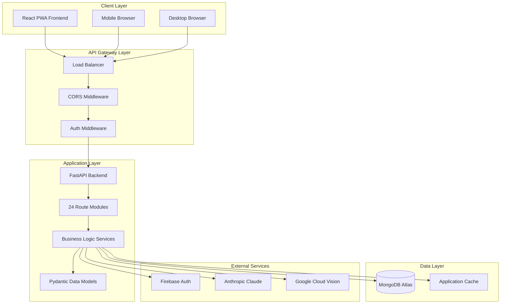
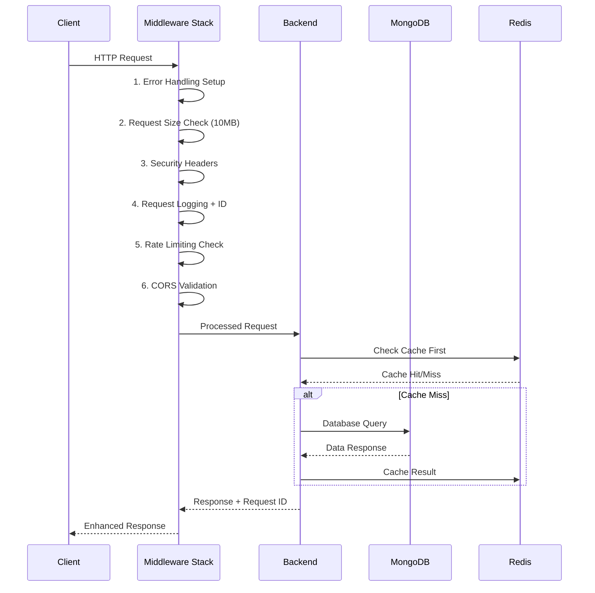
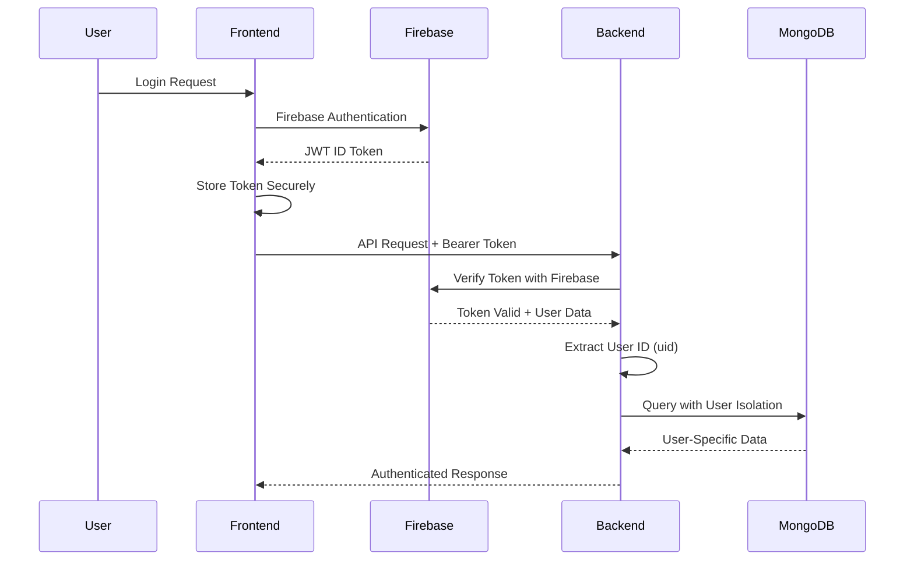
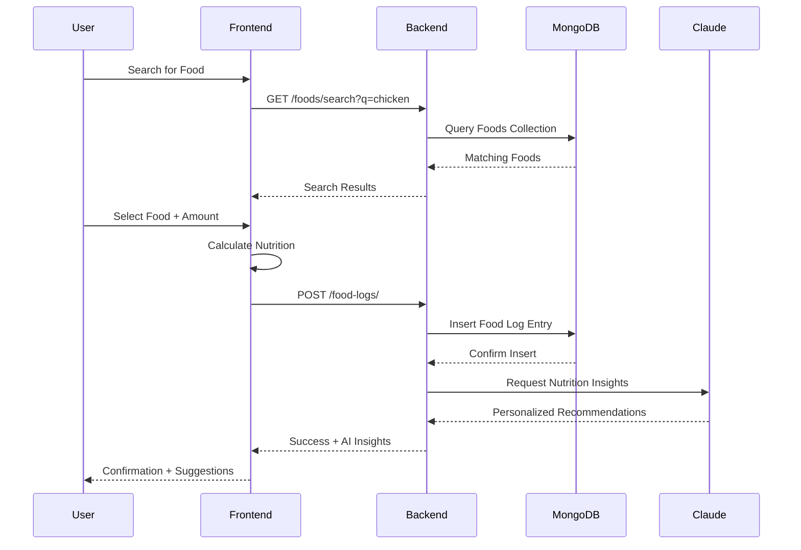
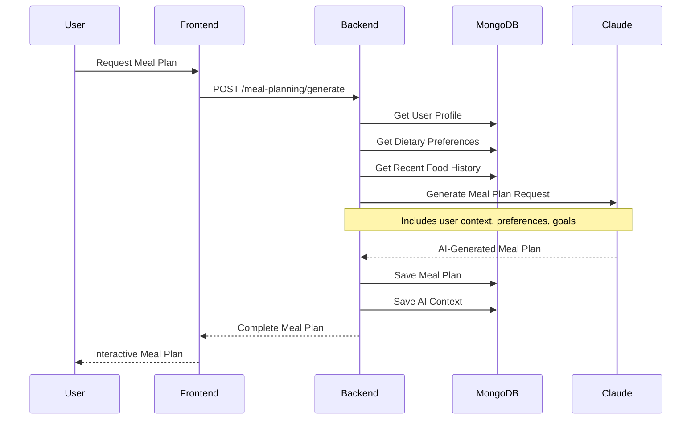

# 🏗️ Nutrivize V2 - System Architecture Overview

## 📋 **Table of Contents**
- [System Overview](#system-overview)
- [Technology Stack](#technology-stack)
- [High-Level Architecture](#high-level-architecture)
- [Application Structure](#application-structure)
- [Data Flow Patterns](#data-flow-patterns)
- [Integration Patterns](#integration-patterns)
- [Scalability & Performance](#scalability--performance)

---

## 🎯 **System Overview**

Nutrivize V2 is a **modern full-stack nutrition tracking application** that combines AI-powered meal planning with comprehensive health analytics. The system is built using a **microservices-ready architecture** with clear separation between frontend, backend, and external services.

### **Core Value Propositions**
- 🤖 **AI-Powered Intelligence**: Claude-based meal planning and personalized health insights
- 📱 **Mobile-First Design**: Progressive Web App (PWA) with offline capabilities
- 🔒 **Enterprise Security**: Firebase authentication with complete user data isolation
- 📊 **Advanced Analytics**: Real-time nutrition tracking with goal monitoring
- 🌐 **Cloud-Native**: Scalable deployment on modern cloud platforms

---

## 🛠️ **Technology Stack**

### **Core Technologies**
```yaml
Backend Framework: FastAPI (Python 3.11+) with Production Enhancements
Frontend Framework: React 18 (TypeScript)
Database: MongoDB Atlas (Cloud NoSQL)
Cache Layer: Redis Cloud (High-performance caching)
Authentication: Firebase Authentication
AI Engine: Anthropic Claude API
Build Tool: Vite (Frontend), Uvicorn (Backend)
Deployment: Render.com (Frontend + Backend)
```

### **Production Features (v2.0)**
```yaml
Security:
  - Multi-layer security headers (XSS, CSRF, Frame protection)
  - Rate limiting with burst allowance (120 req/min + 20 burst)
  - Request size limits (10MB max)
  - Content Security Policy enforcement

Error Handling:
  - Structured error responses with request tracking
  - Custom exception hierarchy (8 specialized types)
  - Request ID correlation for debugging
  - Enhanced validation with field constraints

Monitoring:
  - Health check endpoint with service status
  - Request/response logging with performance metrics
  - Database and Redis connectivity monitoring
  - Production-ready error tracking

Performance:
  - Redis caching with smart TTL strategies
  - Optimized middleware stack ordering
  - Input validation and sanitization
  - Database connection pooling
```

### **Key Libraries & Services**
```yaml
Backend:
  - FastAPI: Modern async web framework
  - Motor: Async MongoDB driver
  - Pydantic: Data validation and serialization
  - Firebase Admin: Authentication verification
  - Anthropic: AI conversation and meal planning

Frontend:
  - React 18: Modern React with hooks
  - TypeScript: Type safety and developer experience
  - Chakra UI: Component library with accessibility
  - React Router: Client-side routing
  - Axios: HTTP client with interceptors
```

---

## 🏛️ **High-Level Architecture**

### **System Architecture Diagram**


### **Service Communication Patterns**
- **Client ↔ API**: HTTPS REST with JWT authentication
- **Backend ↔ Database**: Encrypted MongoDB Atlas connection
- **Backend ↔ Firebase**: Admin SDK for token verification
- **Backend ↔ AI Services**: Secure API key authentication
- **Frontend ↔ Firebase**: Direct authentication for user management

---

## 📁 **Application Structure**

### **Backend Architecture (FastAPI)**
```
backend/app/
├── main.py                 # Application entry point and configuration
├── core/                   # Core system components
│   ├── config.py          # Environment and database configuration
│   ├── firebase.py        # Firebase authentication setup
│   ├── database.py        # MongoDB connection management
│   ├── redis_client.py    # Redis caching with smart TTL strategies
│   ├── security.py        # Production security middleware suite
│   ├── error_handling.py  # Enhanced error handling and logging
│   └── exceptions.py      # Custom exception hierarchy (8 types)
├── routes/                 # API endpoint definitions (24 modules)
│   ├── auth.py            # User authentication and registration
│   ├── foods.py           # Food database search and management
│   ├── food_logs.py       # Daily nutrition logging
│   ├── ai.py              # AI chat and recommendations
│   ├── meal_planning.py   # Meal plan generation and management
│   ├── analytics.py       # Nutrition and usage analytics
│   ├── user_preferences.py # User settings and preferences
│   ├── goals.py           # Health and nutrition goal tracking
│   ├── favorites.py       # User favorite foods management
│   ├── restaurant_ai.py   # Restaurant menu analysis
│   ├── ai_dashboard.py    # Dashboard-specific AI insights
│   ├── ai_health.py       # Health score and coaching
│   ├── user_foods.py      # Custom user-created foods
│   ├── dietary.py         # Dietary restriction management
│   ├── water_logs.py      # Hydration tracking
│   ├── weight_logs.py     # Weight tracking and trends
│   └── nutrition_labels.py # OCR nutrition label processing
├── services/              # Business logic layer
│   ├── ai_service.py      # Claude API integration and prompts
│   ├── food_service.py    # Food data management and search
│   ├── user_service.py    # User profile and preference management
│   ├── analytics_service.py # Analytics and reporting logic
│   ├── nutrition_service.py # Nutrition calculation utilities
│   ├── meal_planning_service.py # Meal plan generation logic
│   ├── ocr_service.py     # Image processing and OCR
│   └── notification_service.py # User notifications and alerts
├── models/                # Pydantic data models and schemas
│   ├── user.py           # User profile and authentication models
│   ├── food.py           # Food item and nutrition models
│   ├── meal_plan.py      # Meal planning and recipe models
│   ├── analytics.py      # Analytics and reporting models
│   ├── ai.py             # AI request/response models
│   ├── health.py         # Health tracking and goal models
│   └── common.py         # Shared model utilities
└── utils/                 # Utility functions and helpers
    ├── database.py        # Database connection utilities
    ├── auth_utils.py      # JWT token management
    ├── validation.py      # Data validation helpers
    ├── formatting.py      # Data formatting utilities
    ├── calculations.py    # Nutrition calculation functions
    └── constants.py       # Application constants
```

### **Frontend Architecture (React + TypeScript)**
```
frontend/src/
├── App.tsx                 # Root application component with routing
├── main.tsx               # Application entry point and providers
├── components/             # Reusable UI components (35+ components)
│   ├── auth/              # Authentication components (3 components)
│   │   ├── LoginForm.tsx
│   │   ├── RegisterForm.tsx
│   │   └── AuthGuard.tsx
│   ├── food/              # Food-related components (12 components)
│   │   ├── FoodSearch.tsx
│   │   ├── FoodLoggingModal.tsx
│   │   ├── BatchFoodLogging.tsx
│   │   ├── NutritionDisplay.tsx
│   │   ├── FoodDetailsModal.tsx
│   │   ├── FoodCategories.tsx
│   │   ├── QuickFoodLog.tsx
│   │   ├── FoodAutoComplete.tsx
│   │   ├── ServingSizeSelector.tsx
│   │   ├── FoodNutritionCard.tsx
│   │   ├── FoodFavoriteButton.tsx
│   │   └── FoodSearchFilters.tsx
│   ├── nutrition/         # Nutrition analysis components (5 components)
│   │   ├── CalorieTracker.tsx
│   │   ├── MacroBreakdown.tsx
│   │   ├── NutritionSummary.tsx
│   │   ├── DailyNutritionChart.tsx
│   │   └── MicronutrientDisplay.tsx
│   ├── dashboard/         # Dashboard and analytics components (8 components)
│   │   ├── DashboardOverview.tsx
│   │   ├── NutritionSummaryCard.tsx
│   │   ├── HealthScoreCard.tsx
│   │   ├── QuickActionCards.tsx
│   │   ├── AIInsightsPanel.tsx
│   │   ├── ProgressVisualization.tsx
│   │   ├── GoalTrackingCard.tsx
│   │   └── RecentActivityFeed.tsx
│   ├── ui/                # Generic UI components (8 components)
│   │   ├── Navigation.tsx
│   │   ├── LoadingSpinner.tsx
│   │   ├── ConfirmationModal.tsx
│   │   ├── ErrorBoundary.tsx
│   │   ├── SearchInput.tsx
│   │   ├── DatePicker.tsx
│   │   ├── ToastNotification.tsx
│   │   └── ResponsiveContainer.tsx
│   └── analytics/         # Advanced analytics components (4 components)
│       ├── ProgressCharts.tsx
│       ├── TrendAnalysis.tsx
│       ├── ComparisonCharts.tsx
│       └── ExportReports.tsx
├── pages/                 # Top-level page components (22 pages)
│   ├── AIDashboard.tsx    # Main dashboard (home page)
│   ├── FoodLog.tsx        # Food logging interface
│   ├── FoodIndex.tsx      # Food database and search
│   ├── MealPlans.tsx      # Meal planning system
│   ├── Analytics.tsx      # Analytics dashboard
│   ├── AIChat.tsx         # AI conversation interface
│   ├── RestaurantAI.tsx   # Restaurant AI features
│   ├── Settings.tsx       # User settings and preferences
│   ├── Profile.tsx        # User profile management
│   ├── Goals.tsx          # Goal setting and tracking
│   ├── Favorites.tsx      # User favorite foods
│   ├── WaterLog.tsx       # Hydration tracking
│   ├── WeightLog.tsx      # Weight tracking
│   ├── Reports.tsx        # Nutrition reports
│   ├── BarcodeScan.tsx    # Barcode scanning interface
│   ├── ManualMealPlanner.tsx # Manual meal planning
│   ├── NutritionLabel.tsx # Nutrition label OCR
│   ├── UserFoods.tsx      # Custom user foods
│   ├── DietaryPreferences.tsx # Dietary settings
│   ├── HealthInsights.tsx # Health coaching
│   ├── Import.tsx         # Data import tools
│   └── Export.tsx         # Data export tools
├── contexts/              # React Context providers
│   ├── AuthContext.tsx    # Firebase authentication state
│   ├── AppStateContext.tsx # Global application state
│   └── FoodIndexContext.tsx # Food database state management
├── hooks/                 # Custom React hooks
│   ├── useAuth.ts         # Authentication hook
│   ├── useApi.ts          # API interaction hook
│   ├── useFoodSearch.ts   # Food search functionality
│   └── useLocalStorage.ts # Local storage management
├── utils/                 # Utility functions
│   ├── api.ts             # Axios API client configuration
│   ├── auth.ts            # Firebase authentication utilities
│   ├── validation.ts      # Form validation utilities
│   ├── formatting.ts      # Data formatting utilities
│   └── constants.ts       # Application constants
└── types/                 # TypeScript type definitions
    ├── index.ts           # Common type exports
    ├── food.ts            # Food and nutrition types
    ├── user.ts            # User and authentication types
    ├── api.ts             # API request/response types
    └── analytics.ts       # Analytics and reporting types
```

---

## 🔄 **Data Flow Patterns**

### **Enhanced Request Processing Pipeline (Production v2.0)**


### **Middleware Stack Order (Optimized)**
```yaml
1. ErrorHandlingMiddleware     # Catch all exceptions
2. RequestSizeLimitMiddleware  # Early payload rejection
3. SecurityHeadersMiddleware   # Security headers injection
4. RequestLoggingMiddleware    # Request tracking + performance
5. RateLimitMiddleware         # Traffic control with burst
6. CORSMiddleware              # Cross-origin validation
```

### **User Authentication Flow**


### **Food Logging Flow**


### **AI Meal Planning Flow**


---

## 🔗 **Integration Patterns**

### **API Integration Strategy**
```typescript
// Centralized API client with automatic auth and error handling
class ApiClient {
  private client: AxiosInstance
  
  constructor() {
    this.client = axios.create({
      baseURL: process.env.VITE_API_BASE_URL,
      timeout: 10000,
    })
    
    this.setupInterceptors()
  }
  
  private setupInterceptors() {
    // Request interceptor for auth
    this.client.interceptors.request.use((config) => {
      const token = getAuthToken()
      if (token) {
        config.headers.Authorization = `Bearer ${token}`
      }
      return config
    })
    
    // Response interceptor for error handling
    this.client.interceptors.response.use(
      (response) => response,
      (error) => {
        if (error.response?.status === 401) {
          // Token expired, redirect to login
          clearAuthToken()
          window.location.href = '/login'
        }
        return Promise.reject(error)
      }
    )
  }
  
  // Typed API methods
  async searchFoods(query: string): Promise<FoodItem[]> {
    const response = await this.client.get<ApiResponse<FoodItem[]>>(
      `/foods/search?q=${encodeURIComponent(query)}`
    )
    return response.data.data
  }
  
  async logFood(foodLog: FoodLogCreate): Promise<FoodLog> {
    const response = await this.client.post<ApiResponse<FoodLog>>(
      '/food-logs/', foodLog
    )
    return response.data.data
  }
}
```

### **State Management Pattern**
```typescript
// Context-based state management with reducers
interface AppState {
  currentDate: string
  selectedMealType: string
  recentFoods: FoodItem[]
  dailyNutrition: NutritionSummary
  loading: boolean
}

const AppStateContext = createContext<{
  state: AppState
  dispatch: Dispatch<AppAction>
}>()

// Reducer for state management
function appStateReducer(state: AppState, action: AppAction): AppState {
  switch (action.type) {
    case 'SET_DATE':
      return { ...state, currentDate: action.payload }
    case 'SET_MEAL_TYPE':
      return { ...state, selectedMealType: action.payload }
    case 'UPDATE_DAILY_NUTRITION':
      return { ...state, dailyNutrition: action.payload }
    case 'SET_LOADING':
      return { ...state, loading: action.payload }
    default:
      return state
  }
}
```

### **Error Handling Strategy**
```python
# Consistent error handling across all endpoints
from fastapi import HTTPException
from pydantic import ValidationError

class NutrivizeException(Exception):
    """Base exception for Nutrivize-specific errors"""
    def __init__(self, message: str, status_code: int = 400):
        self.message = message
        self.status_code = status_code
        super().__init__(message)

class UserNotFoundError(NutrivizeException):
    def __init__(self):
        super().__init__("User not found", 404)

class FoodNotFoundError(NutrivizeException):
    def __init__(self, food_id: str):
        super().__init__(f"Food with ID {food_id} not found", 404)

# Global exception handler
@app.exception_handler(NutrivizeException)
async def nutrivize_exception_handler(request: Request, exc: NutrivizeException):
    return JSONResponse(
        status_code=exc.status_code,
        content={
            "detail": exc.message,
            "timestamp": datetime.utcnow().isoformat(),
            "path": str(request.url.path)
        }
    )
```

---

## ⚡ **Scalability & Performance**

### **Performance Characteristics**
```yaml
Backend Performance:
  - Async/Await: Non-blocking I/O operations
  - Connection Pooling: Efficient database connections
  - Response Caching: In-memory caching for frequent queries
  - Pagination: Efficient large dataset handling

Frontend Performance:
  - Code Splitting: Lazy loading for route components
  - Bundle Optimization: Tree shaking and minification
  - State Optimization: Efficient React Context usage
  - Caching: Browser caching and service workers
```

### **Scalability Patterns**
```python
# Horizontal scalability through stateless design
class StatelessService:
    def __init__(self, db: Database):
        self.db = db
    
    async def process_request(self, user_id: str, data: dict):
        # No instance state - can run on any server
        # All state comes from database or request
        return await self.db.collection.find_one({
            "user_id": user_id,
            **data
        })

# Database optimization for scale
async def get_user_nutrition_summary(
    user_id: str,
    date_from: datetime,
    date_to: datetime
) -> NutritionSummary:
    # Aggregation pipeline for efficient computation
    pipeline = [
        {"$match": {
            "user_id": user_id,
            "date": {"$gte": date_from, "$lte": date_to}
        }},
        {"$group": {
            "_id": "$meal_type",
            "total_calories": {"$sum": "$nutrition.calories"},
            "total_protein": {"$sum": "$nutrition.protein"},
            "total_carbs": {"$sum": "$nutrition.carbs"},
            "total_fat": {"$sum": "$nutrition.fat"}
        }}
    ]
    
    results = await db.food_logs.aggregate(pipeline).to_list(10)
    return NutritionSummary.from_aggregation(results)
```

### **Monitoring and Observability**
```python
# Performance monitoring decorator
import time
from functools import wraps

def monitor_performance(operation: str):
    def decorator(func):
        @wraps(func)
        async def wrapper(*args, **kwargs):
            start_time = time.time()
            
            try:
                result = await func(*args, **kwargs)
                duration = time.time() - start_time
                
                logger.info(f"Operation {operation} completed", extra={
                    "operation": operation,
                    "duration": duration,
                    "status": "success"
                })
                
                return result
                
            except Exception as e:
                duration = time.time() - start_time
                
                logger.error(f"Operation {operation} failed", extra={
                    "operation": operation,
                    "duration": duration,
                    "status": "error",
                    "error": str(e)
                })
                
                raise
        
        return wrapper
    return decorator

# Usage
@monitor_performance("food_search")
async def search_foods(query: str, user_id: str):
    # Implementation
    pass
```

---

## 🎯 **Architecture Benefits**

### **Maintainability**
- **Clear Separation**: Frontend, backend, and database concerns are isolated
- **Modular Design**: 24 backend modules and feature-based frontend components
- **Type Safety**: TypeScript frontend and Pydantic backend models
- **Consistent Patterns**: Standardized error handling and API responses

### **Scalability**
- **Stateless Backend**: Can scale horizontally across multiple servers
- **Database Optimization**: Efficient indexing and aggregation pipelines
- **Caching Strategy**: Multiple levels of caching for performance
- **Microservices Ready**: Clear module boundaries for future service separation

### **Security**
- **Zero Trust**: Every request is authenticated and authorized
- **Data Isolation**: User data is completely segregated
- **Input Validation**: Comprehensive validation at all layers
- **Secure Communication**: HTTPS/TLS encryption throughout

---

This architecture overview provides a comprehensive understanding of Nutrivize V2's system design, emphasizing modern practices, scalability, and maintainability while maintaining clarity for developers at all levels.
