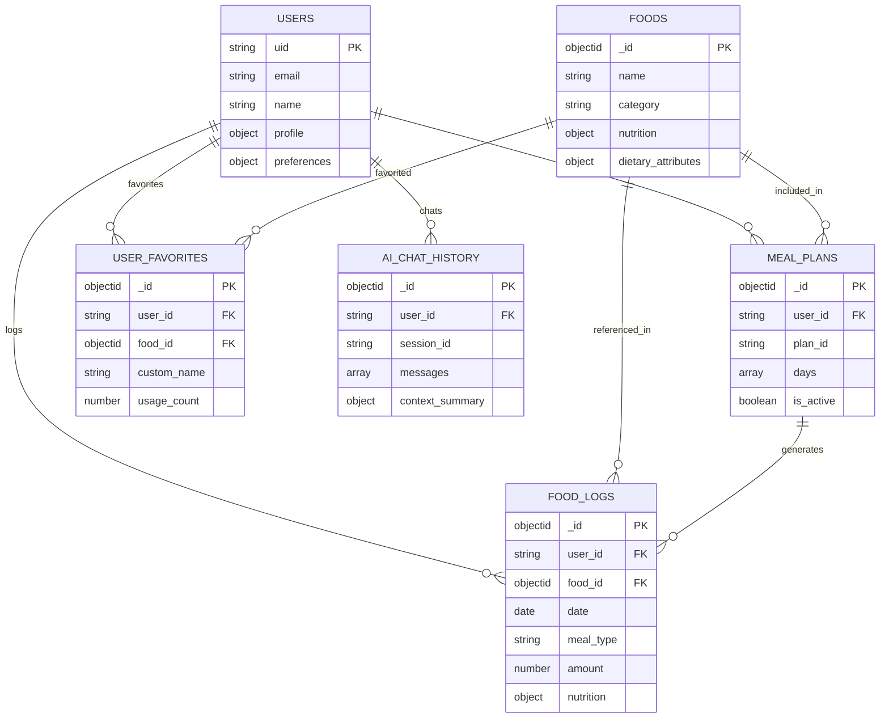

# 🗄️ Nutrivize V2 - Database Schema Documentation

## 📋 **Table of Contents**
- [Overview](#overview)
- [MongoDB Collections](#mongodb-collections)
- [Collection Schemas](#collection-schemas)
- [Indexing Strategy](#indexing-strategy)
- [Data Relationships](#data-relationships)
- [Performance Optimization](#performance-optimization)

---

## 🎯 **Overview**

Nutrivize V2 uses **MongoDB Atlas** as the primary database with a user-centric design. All data is isolated by user ID (`uid` from Firebase Authentication) to ensure privacy and security.

### **Database Configuration**
- **Database Provider**: MongoDB Atlas (Cloud)
- **Connection**: TLS encrypted with connection pooling
- **Backup Strategy**: Automated cloud backups
- **User Isolation**: All queries filtered by authenticated user ID

---

## 📊 **MongoDB Collections**

The database consists of **6 main collections** that store all application data:

| Collection | Purpose | Size | Key Features |
|------------|---------|------|--------------|
| `users` | User profiles and preferences | ~1KB per user | Profile data, dietary preferences |
| `foods` | Food database (shared) | ~2KB per food | Nutrition data, dietary attributes |
| `food_logs` | Daily nutrition logs | ~500B per entry | Meal tracking, nutrition calculations |
| `meal_plans` | AI and manual meal plans | ~10KB per plan | Multi-day plans, shopping lists |
| `user_favorites` | User favorite foods | ~1KB per favorite | Custom serving sizes, usage tracking |
| `ai_chat_history` | AI conversation history | ~5KB per session | Context-aware AI responses |

---

## 📋 **Collection Schemas**

### **Users Collection**
```javascript
{
  _id: ObjectId,                // MongoDB document ID
  uid: String,                  // Firebase UID (unique identifier)
  email: String,                // User email address
  name: String,                 // User display name
  created_at: ISODate,          // Account creation timestamp
  updated_at: ISODate,          // Last profile update
  
  // User Profile Information
  profile: {
    age: Number,                // Age in years
    gender: String,             // "male" | "female" | "other"
    height_cm: Number,          // Height in centimeters
    weight_kg: Number,          // Weight in kilograms
    activity_level: String,     // "sedentary" | "lightly_active" | "moderately_active" | "very_active" | "extra_active"
    dietary_preferences: [String], // ["vegetarian", "vegan", "keto", "paleo", etc.]
    allergens: [String],        // ["nuts", "dairy", "gluten", "shellfish", etc.]
    health_goals: [String]      // ["weight_loss", "muscle_gain", "maintain_weight", etc.]
  },
  
  // User Preferences and Settings
  preferences: {
    units: String,              // "metric" | "imperial"
    timezone: String,           // User timezone (e.g., "America/New_York")
    notifications: Boolean,     // Email notifications enabled
    privacy_level: String       // "public" | "friends" | "private"
  }
}
```

### **Foods Collection**
```javascript
{
  _id: ObjectId,                // MongoDB document ID
  name: String,                 // Food name (e.g., "Chicken Breast, Grilled")
  brand: String,                // Optional brand name (e.g., "Tyson")
  category: String,             // Food category ("protein", "grain", "vegetable", etc.)
  serving_size: Number,         // Default serving size amount
  serving_unit: String,         // Default unit ("cup", "gram", "piece", "slice", etc.)
  
  // Nutritional Information (per serving)
  nutrition: {
    calories: Number,           // Calories per serving
    protein: Number,            // Protein in grams
    carbs: Number,              // Total carbohydrates in grams
    fat: Number,                // Total fat in grams
    fiber: Number,              // Dietary fiber in grams
    sugar: Number,              // Total sugars in grams
    sodium: Number,             // Sodium in milligrams
    cholesterol: Number,        // Cholesterol in milligrams
    saturated_fat: Number,      // Saturated fat in grams
    trans_fat: Number,          // Trans fat in grams
    monounsaturated_fat: Number, // Monounsaturated fat in grams
    polyunsaturated_fat: Number, // Polyunsaturated fat in grams
    vitamin_c: Number,          // Vitamin C in milligrams
    calcium: Number,            // Calcium in milligrams
    iron: Number                // Iron in milligrams
  },
  
  // Dietary Attributes and Restrictions
  dietary_attributes: {
    vegetarian: Boolean,        // Suitable for vegetarians
    vegan: Boolean,             // Suitable for vegans
    gluten_free: Boolean,       // Gluten-free
    dairy_free: Boolean,        // Dairy-free
    nut_free: Boolean,          // Nut-free
    soy_free: Boolean,          // Soy-free
    egg_free: Boolean,          // Egg-free
    fish_free: Boolean,         // Fish-free
    shellfish_free: Boolean,    // Shellfish-free
    kosher: Boolean,            // Kosher certified
    halal: Boolean,             // Halal certified
    organic: Boolean,           // Organic
    non_gmo: Boolean           // Non-GMO
  },
  
  // Additional Metadata
  barcode: String,              // Optional UPC/EAN barcode for scanning
  source: String,               // Data source: "USDA" | "user" | "restaurant" | "API"
  created_by: String,           // User ID if user-created food
  created_at: ISODate,          // Creation timestamp
  updated_at: ISODate,          // Last update timestamp
  search_keywords: [String],    // Additional keywords for search optimization
  popularity_score: Number,     // Usage-based ranking (0-100)
  verified: Boolean             // Whether food data is verified
}
```

### **Food Logs Collection**
```javascript
{
  _id: ObjectId,                // MongoDB document ID
  user_id: String,              // Firebase UID (foreign key to users.uid)
  date: ISODate,                // Date of consumption (YYYY-MM-DD format)
  meal_type: String,            // "breakfast" | "lunch" | "dinner" | "snack"
  
  // Food Reference Information
  food_id: ObjectId,            // Reference to Foods collection
  food_name: String,            // Cached food name for quick retrieval
  food_brand: String,           // Cached brand name
  
  // Consumption Details
  amount: Number,               // Amount consumed
  unit: String,                 // Unit of measurement
  serving_size_ratio: Number,   // Multiplier for nutrition calculation
  
  // Calculated Nutrition (for this specific entry)
  nutrition: {
    calories: Number,           // Calculated calories for this amount
    protein: Number,            // Calculated protein in grams
    carbs: Number,              // Calculated carbs in grams
    fat: Number,                // Calculated fat in grams
    fiber: Number,              // Calculated fiber in grams
    sugar: Number,              // Calculated sugar in grams
    sodium: Number,             // Calculated sodium in milligrams
    cholesterol: Number,        // Calculated cholesterol in milligrams
    saturated_fat: Number,      // Calculated saturated fat in grams
    vitamin_c: Number,          // Calculated vitamin C in milligrams
    calcium: Number,            // Calculated calcium in milligrams
    iron: Number                // Calculated iron in milligrams
  },
  
  // Additional Information
  notes: String,                // Optional user notes
  recipe_multiplier: Number,    // For recipes, scaling factor
  logged_at: ISODate,           // When the entry was logged
  created_at: ISODate,          // Creation timestamp
  updated_at: ISODate,          // Last update timestamp
  source: String                // "manual" | "barcode" | "voice" | "ai_suggestion"
}
```

### **Meal Plans Collection**
```javascript
{
  _id: ObjectId,                // MongoDB document ID
  user_id: String,              // Firebase UID (foreign key to users.uid)
  plan_id: String,              // Unique plan identifier
  name: String,                 // Plan name (e.g., "Week 1 Muscle Building")
  description: String,          // Plan description
  
  // Plan Configuration
  days: Number,                 // Number of days (1-30)
  calories_per_day: Number,     // Target calories per day
  protein_target: Number,       // Daily protein target (grams)
  carbs_target: Number,         // Daily carbs target (grams)
  fat_target: Number,           // Daily fat target (grams)
  dietary_preferences: [String], // Applied dietary filters
  
  // Daily Structure
  days: [{
    day_number: Number,         // Day number in plan (1-30)
    date: String,               // Target date (YYYY-MM-DD format)
    
    // Meals for this day
    meals: [{
      meal_type: String,        // "breakfast" | "lunch" | "dinner" | "snack"
      food_name: String,        // Food name
      food_id: ObjectId,        // Reference to Foods collection
      amount: Number,           // Amount to consume
      unit: String,             // Unit of measurement
      
      // Calculated nutrition for this meal
      nutrition: {
        calories: Number,
        protein: Number,
        carbs: Number,
        fat: Number,
        fiber: Number,
        sodium: Number
      },
      
      notes: String,            // Meal-specific notes
      preparation_time: Number, // Estimated prep time in minutes
      cooking_method: String,   // "baked", "grilled", "raw", etc.
      is_logged: Boolean,       // Whether this meal was logged to food diary
      cost_estimate: Number     // Estimated cost in USD
    }],
    
    // Daily totals
    daily_nutrition: {
      calories: Number,         // Total calories for the day
      protein: Number,          // Total protein for the day
      carbs: Number,            // Total carbs for the day
      fat: Number,              // Total fat for the day
      fiber: Number,            // Total fiber for the day
      sodium: Number            // Total sodium for the day
    },
    
    shopping_list: [String],    // Foods needed for this day
    estimated_cost: Number      // Estimated cost for this day
  }],
  
  // Plan Metadata
  is_active: Boolean,           // Whether plan is currently active
  completion_percentage: Number, // How much of plan is completed (0-100)
  total_estimated_cost: Number, // Total estimated cost for entire plan
  difficulty_level: String,     // "easy" | "medium" | "hard"
  created_at: ISODate,          // Creation timestamp
  updated_at: ISODate,          // Last update timestamp
  generated_by: String,         // "ai" | "manual" | "template"
  version: Number,              // Plan version for versioning
  parent_plan_id: String        // If copied from another plan
}
```

### **User Favorites Collection**
```javascript
{
  _id: ObjectId,                // MongoDB document ID
  user_id: String,              // Firebase UID (foreign key to users.uid)
  food_id: ObjectId,            // Reference to Foods collection
  
  // Cached Food Information
  food_name: String,            // Cached food name
  food_brand: String,           // Cached brand name
  
  // User Customizations
  custom_name: String,          // User's custom name for this food
  category: String,             // User category: "breakfast" | "lunch" | "dinner" | "snack" | "general"
  default_serving_size: Number, // User's preferred serving size
  default_serving_unit: String, // User's preferred unit
  
  // Organization and Metadata
  tags: [String],               // User-defined tags ["quick", "healthy", "budget", etc.]
  notes: String,                // User notes about this food
  color: String,                // UI color for organization
  
  // Usage Statistics
  usage_count: Number,          // How many times this favorite was used
  last_used: ISODate,           // Last time this favorite was used
  frequency_score: Number,      // Calculated frequency score (0-100)
  
  // Cached Data (for performance)
  nutrition: {                  // Cached nutrition info
    calories: Number,
    protein: Number,
    carbs: Number,
    fat: Number
  },
  dietary_attributes: {         // Cached dietary attributes
    vegetarian: Boolean,
    vegan: Boolean,
    gluten_free: Boolean,
    dairy_free: Boolean
  },
  
  // Timestamps
  created_at: ISODate,          // When favorite was added
  updated_at: ISODate           // Last update timestamp
}
```

### **AI Chat History Collection**
```javascript
{
  _id: ObjectId,                // MongoDB document ID
  user_id: String,              // Firebase UID (foreign key to users.uid)
  session_id: String,           // Chat session identifier
  
  // Conversation Messages
  messages: [{
    message_id: String,         // Unique message identifier
    role: String,               // "user" | "assistant"
    content: String,            // Message content
    timestamp: ISODate,         // Message timestamp
    
    // AI Response Context
    context: {
      food_recommendations: [ObjectId], // Recommended food IDs
      meal_suggestions: [{      // Meal suggestions provided
        meal_type: String,
        foods: [ObjectId],
        total_calories: Number
      }],
      nutrition_analysis: {     // Nutrition insights provided
        daily_calories: Number,
        protein_status: String,
        recommendations: [String]
      },
      goal_progress: {          // Goal-related insights
        current_progress: Number,
        target: Number,
        status: String
      }
    },
    
    // Message Metadata
    response_time: Number,      // AI response time in milliseconds
    confidence_score: Number,   // AI confidence (0-1)
    sources: [String]           // Data sources used for response
  }],
  
  // Session-Level Context
  context_summary: {
    user_goals: [String],       // Active user goals
    dietary_preferences: [String], // User dietary preferences
    recent_foods: [ObjectId],   // Recently logged foods
    current_nutrition: {        // Current day nutrition status
      calories: Number,
      protein: Number,
      carbs: Number,
      fat: Number
    },
    active_meal_plan: ObjectId, // Current active meal plan
    conversation_topic: String  // Main conversation theme
  },
  
  // Session Metadata
  session_type: String,         // "nutrition_coaching" | "meal_planning" | "general"
  language: String,             // User language preference
  created_at: ISODate,          // Session start timestamp
  updated_at: ISODate,          // Last message timestamp
  ended_at: ISODate,            // Session end timestamp (if applicable)
  message_count: Number,        // Total messages in session
  session_rating: Number        // User rating (1-5) if provided
}
```

---

## 🔍 **Indexing Strategy**

### **Performance-Critical Indexes**
```javascript
// Users Collection - Authentication and profile lookups
db.users.createIndex({ "uid": 1 }, { unique: true })
db.users.createIndex({ "email": 1 }, { unique: true })

// Food Logs Collection - Daily nutrition queries
db.food_logs.createIndex({ "user_id": 1, "date": -1 })
db.food_logs.createIndex({ "user_id": 1, "meal_type": 1, "date": -1 })
db.food_logs.createIndex({ "user_id": 1, "food_id": 1 })

// Foods Collection - Search and filtering
db.foods.createIndex({ "name": "text", "search_keywords": "text" })
db.foods.createIndex({ "category": 1, "popularity_score": -1 })
db.foods.createIndex({ "barcode": 1 }, { sparse: true })
db.foods.createIndex({ "dietary_attributes.vegetarian": 1 })
db.foods.createIndex({ "dietary_attributes.vegan": 1 })
db.foods.createIndex({ "dietary_attributes.gluten_free": 1 })

// Meal Plans Collection - Plan management
db.meal_plans.createIndex({ "user_id": 1, "is_active": 1 })
db.meal_plans.createIndex({ "user_id": 1, "created_at": -1 })

// User Favorites Collection - Quick access to favorites
db.user_favorites.createIndex({ "user_id": 1, "category": 1 })
db.user_favorites.createIndex({ "user_id": 1, "usage_count": -1 })
db.user_favorites.createIndex({ "user_id": 1, "last_used": -1 })

// AI Chat History Collection - Conversation retrieval
db.ai_chat_history.createIndex({ "user_id": 1, "created_at": -1 })
db.ai_chat_history.createIndex({ "user_id": 1, "session_type": 1 })
```

### **Compound Indexes for Complex Queries**
```javascript
// Date range queries for food logs
db.food_logs.createIndex({ 
  "user_id": 1, 
  "date": 1, 
  "meal_type": 1 
})

// Food search with dietary filters
db.foods.createIndex({ 
  "category": 1, 
  "dietary_attributes.vegetarian": 1,
  "popularity_score": -1 
})

// Favorite foods by usage and category
db.user_favorites.createIndex({ 
  "user_id": 1, 
  "category": 1, 
  "usage_count": -1 
})
```

---

## 🔗 **Data Relationships**

### **Collection Relationships**


---

## ⚡ **Performance Optimization**

### **Query Optimization Patterns**
```javascript
// Efficient date range queries
db.food_logs.find({
  "user_id": "firebase_uid_123",
  "date": {
    $gte: ISODate("2025-01-01"),
    $lt: ISODate("2025-01-08")
  }
}).sort({ "date": -1 })

// Aggregated nutrition by meal type
db.food_logs.aggregate([
  { $match: { 
    "user_id": "firebase_uid_123",
    "date": { $gte: ISODate("2025-01-20") }
  }},
  { $group: {
    _id: "$meal_type",
    total_calories: { $sum: "$nutrition.calories" },
    total_protein: { $sum: "$nutrition.protein" }
  }}
])

// Popular foods with dietary filters
db.foods.find({
  "dietary_attributes.vegetarian": true,
  "category": "protein"
}).sort({ "popularity_score": -1 }).limit(20)
```

### **Caching Strategy**
- **Application-Level Caching**: Frequently accessed foods and user preferences
- **Database-Level Caching**: MongoDB internal query result caching
- **Denormalization**: Cached nutrition data in food_logs for quick access
- **Aggregation Pipelines**: Pre-calculated daily/weekly nutrition summaries

### **Data Lifecycle Management**
- **Archive Old Data**: Move old food logs (>2 years) to archive collection
- **Cleanup Sessions**: Remove inactive AI chat sessions after 90 days
- **Optimize Indexes**: Regular index maintenance and optimization
- **Backup Strategy**: Daily incremental backups with monthly full backups

---

This database schema provides a scalable foundation for Nutrivize V2's nutrition tracking, AI-powered features, and user management capabilities.
